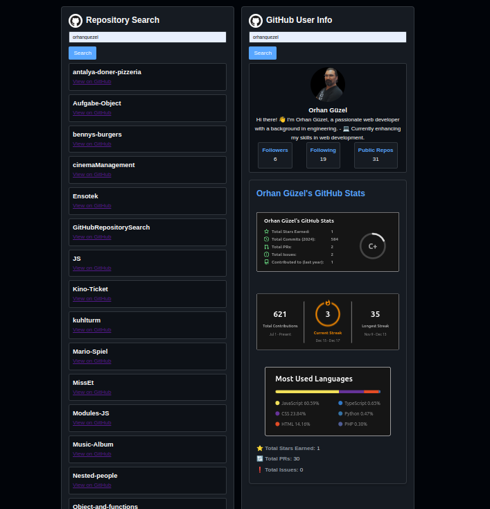

# GitHub User and Repository Search Tool  



### **Description**  
This project is a simple web-based tool that allows users to search for GitHub repositories and user profiles using the GitHub REST API.  
- Users can enter a GitHub username to retrieve their repositories.  
- Users can also search for detailed GitHub user information, including profile details, follower counts, and public repositories.

---

### **Features**  
- 🔍 **Repository Search**: Enter a GitHub username to fetch and display all repositories of the user.  
- 👤 **User Profile Search**: Fetch user details such as bio, avatar, followers, and following count.  
- 📡 **Fetch API**: Uses modern Fetch API to retrieve data from GitHub.  
- 🎨 **Responsive Design**: Works seamlessly across devices (mobile, tablet, desktop).  
- ⚡ **Error Handling**: Displays meaningful messages for errors like invalid usernames or API failures.

---

### **Live Demo**  
Check out the live demo [here](https://orhanguezel.github.io/GitHubRepositorySearch/).

---

### **Screenshots**  
#### **Search Repositories**  


#### **Search User Profiles**  


---

### **Technologies Used**  
- **HTML5**: Structure and layout.  
- **CSS3**: Responsive styling for a clean user interface.  
- **JavaScript**: Fetch API integration and dynamic DOM manipulation.  
- **GitHub API**: Retrieves data about repositories and user profiles.  

---

### **How to Run the Project**  

1. **Clone the Repository**  
   Open your terminal and run:  
   ```bash
   git clone https://github.com/Orhanguezel/GitHubRepositorySearch.git
   cd github-repo-search
   ```

2. **Open in Browser**  
   Simply open the `index.html` file in any browser, or use a local development server:  
   ```bash
   npx serve
   ```

3. **Explore the App**  
   - Enter a GitHub username to search repositories.  
   - Use the second input field to search for user profiles.  

---

### **Project Structure**  
```plaintext
📂 github-repo-search  
│  
├── 📁 css  
│   └── main.css  
│  
├── 📁 js  
│   └── main.js  
│  
├── 📄 index.html  
├── 📄 README.md  
└── 🖼️ demo.png (demo images)  
```

---

### **API Used**  
- **GitHub REST API**  
   - Repositories Endpoint: `/users/{username}/repos`  
   - User Information Endpoint: `/users/{username}`  

For more details, refer to the [GitHub API Documentation](https://docs.github.com/en/rest).

---

### **Contributing**  
Contributions are welcome! If you'd like to improve the project:  
1. Fork the repository.  
2. Create a new branch (`git checkout -b feature-name`).  
3. Make your changes and commit them (`git commit -m "Add feature XYZ"`).  
4. Push to the branch (`git push origin feature-name`).  
5. Open a Pull Request.

---

### **License**  
This project is licensed under the **MIT License**. See the LICENSE file for more information.

---

### **Contact**  
For any questions or feedback, feel free to reach out:  
- **Your Name**  
- **Email**: orhan.guezel@dci-student.org  
- **GitHub**: [your-username](https://github.com/Orhanguezel)

---